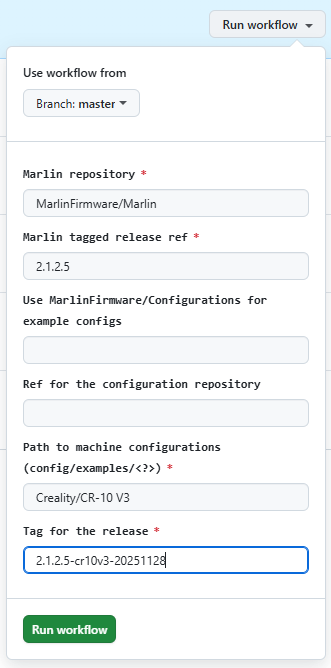

# Tabjy's Marlin firmware builds 

This repository contains my (opinionated) builds of the Marlin 3D printer firmware. Currently I only build for [Creality CR-10 V3](config/examples/Creality/CR-10 V3) since it's the only machine I own.

<!-- TODO: update release tag and link if needed -->

The `master` branch (the branch you're viewing) in this repository tracks configurations for the latest stable Marlin release. Upon the last update, the latest release is tagged [`2.1.2.5`](https://github.com/MarlinFirmware/Marlin/tree/2.1.2.5).

## What's so opinionated?

<!-- TODO: update release tag and link if needed -->

Not much. Mostly small tweaks in configurations. See [diffs here](https://github.com/MarlinFirmware/Configurations/compare/release-2.1.2.5...tabjy:MarlinConfigurations:master).

They boil down to:

- Enables BL (CR) touch and configures offsets (yours might be different!)
- Enables junction deviation 
- Enables muting the buzzer
- Enables linear advance and configures extruder jerk

## Downloads

Compiled firmware can be found in the GitHub [release page](https://github.com/tabjy/MarlinConfigurations/releases). 

*No warranty is given, and no responsibility can be accepted if there are problems. Flash at your own risk!*

## Can you build for my machine?

Nope, but you can easily do that yourself:

1. Fork this repository
2. Go to the *Action* tab; select *Build and release* workflow (`https://github.com/`**`<YOUR_USERNAME>`**`/MarlinConfigurations/actions/workflows/build-release.yml`)
3. Manually trigger a build, with your machine configuration path:

    

4. Watch it goes; find the firmware in your repository's release page